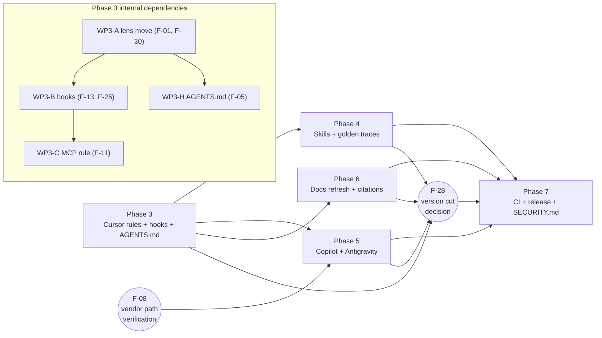

# AI Productivity Kit — Phase 2 Phase Plan

**Audit date:** 2026-04-17
**Auditor route:** SPEC (kit's own protocol; planning only, no execution)
**Audit posture (locked):** Hybrid — markdown rules/prompts as the portable substrate; thin Cursor-native adapters (Hooks, optional Custom Modes, root `AGENTS.md`) where leverage is high.
**Inputs:** [`docs/audit/gap-analysis.md`](gap-analysis.md) (30 findings, evidence, severity, fix directions); [`kit/.cursor/prompts/90-handoff-summary.md`](../../kit/.cursor/prompts/90-handoff-summary.md) (handoff format); [`package.json`](../../package.json) (`1.4.0`); [`kit/cursor-ai-kit.config.json`](../../kit/cursor-ai-kit.config.json) (`1.4.0`); [`CHANGELOG.md`](../../CHANGELOG.md) (last published `1.4.0` 2026-02-19, `Unreleased` carries Antigravity work).
**Scope (in):** `kit/`, `docs/`, `site/docs/`, `.github/workflows/`, top-level `*.md`. **Scope (out):** `starter/` (generated), `site/build/`, `site/node_modules/`, `.git/`.
**Status of Phase 2:** complete — this document. **Phases 3–7:** plan-only; no kit edits authorized by this deliverable.

---

## 1. Scoring rubric

A single, defensible weighted-sum formula is applied uniformly to every finding F-01…F-30. Reviewers can recompute any row from the columns in §2.

```text
Priority = (2 × Impact) + (1.5 × Risk) − (1 × Effort)
```

All three dimensions are integers on a **1–5 scale**.

| Dim | 1 | 2 | 3 | 4 | 5 |
|---|---|---|---|---|---|
| **Impact** (value to user when fixed) | Cosmetic | Quality-of-life | Closes a known gap | Restores a kit-defining claim | Unblocks new capability across editors |
| **Risk** (harm if unfixed) | Trivial drift | Lost feature, no breakage | Silent UX confusion or staleness | Real attack vector or wrong instructions | Active security exposure or visibly broken user surface |
| **Effort** (cost to ship) | One-line / one-file edit | Few-file mechanical change | One rule + sync + 1–2 doc pages | New pattern + cross-tool mirror + doctor check | New infra (hooks, skills, custom mode) + sync + CI + docs |

**Tiebreak ladder (applied in order):**

1. Severity from [`gap-analysis.md`](gap-analysis.md) §4: `Critical → High → Medium → Low`.
2. Phase dependency order (a finding that unblocks another sorts above the dependent).
3. Lower **Effort** first (cheaper wins go in earlier within the same phase).

**Out-of-scope clarifications:**

- All 30 findings remain in scope of this plan. Findings that score in the bottom band are flagged **Defer** in the table and slotted last in their phase, but they are not deleted; Phase 7 cleans them up if the phase has budget.
- Phase boundaries are inherited from [`gap-analysis.md`](gap-analysis.md) §6. Findings are re-slotted only where the priority score forces it (notable cases: F-13 stays in Phase 3 because it must precede F-25 and F-11 enforcement; F-05 stays in Phase 3 because it is the cross-tool substrate the rest of the kit will rely on).

**Methodology note.** Confidence on the scoring is high for the top six (F-01, F-13, F-11, F-14, F-04, F-05) because evidence in [`gap-analysis.md`](gap-analysis.md) §2 and §4 names concrete vendor docs and CVEs. The mid-band (priority 7.0–9.5) is sensitive to ±1 on Effort estimates; the tail (priority ≤ 4.5) is intentionally treated as Defer-eligible regardless of small score perturbations.

---

## 2. Master priority table

Sorted by `Priority` descending, with ties broken by the rules in §1. Phase column is the binding assignment for Phases 3–7.

| ID | Title (short) | Severity | Impact | Risk | Effort | Priority | Phase | Notes |
|---|---|---|---|---|---|---|---|---|
| F-01 | Cursor Subagents path collision (`.cursor/agents/`) | Critical | 5 | 5 | 3 | **14.5** | 3 | Blocks F-30. Must move kit lenses out of the Subagents path. |
| F-13 | Security stop gate has no Hooks teeth | High | 5 | 5 | 4 | **13.5** | 3 | Unblocks F-25; provides enforcement substrate for F-11. |
| F-11 | Empty `mcp.json` + zero MCP-trust guidance | High | 4 | 5 | 2 | **13.5** | 3 | Rule + commented `mcp.json`; enforcement piggy-backs on F-13 hooks. |
| F-14 | Indirect prompt injection via tool-call results | Medium | 4 | 4 | 1 | **13.0** | 3 | One-clause edit to `40-security.mdc`; mirror to `.agent/`. |
| F-04 | Most rules not `alwaysApply` and have no `globs` | High | 4 | 4 | 2 | **12.0** | 3 | Per-rule activation decision; edit 6 frontmatters. |
| F-05 | No root `AGENTS.md` | High | 5 | 2 | 2 | **11.0** | 3 | Generated from kit content via `sync-starter-from-kit.mjs`. |
| F-02 | Switch protocol vs Plan / Agent / Ask modes | High | 4 | 3 | 3 | **9.5** | 3 | Keep Switch: text; add Cursor-mode mapping; rewrite `cursor-modes.md` (Phase 6). |
| F-03 | Platform-type allowed-values drift | High | 3 | 3 | 1 | **9.5** | 3 | Defer to `ai-config.md` in 4 files. |
| F-15 | `SECURITY.md` predates AI-tool risk surface | Medium | 3 | 3 | 1 | **9.5** | 7 | Add AI-tool risk classes section + bump versions. |
| F-08 | Antigravity rules path needs vendor verification | Medium ([LOW-CONFIDENCE]) | 3 | 3 | 2 | **8.5** | 5 | **Verification gate**: precedes all other Phase 5 work. |
| F-09 | Drift risk between `.cursor/rules/*.mdc` and `.agent/rules/*.md` | Medium | 3 | 3 | 2 | **8.5** | 7 | Doctor diff check; or generate `.agent/` tree. |
| F-16 | Checklists are perfect Skills candidates | Medium | 4 | 2 | 3 | **8.0** | 4 | 4 SKILL.md across Cursor + Antigravity surfaces. |
| F-22 | Editor-support pages lack source citations / dates | Medium | 3 | 3 | 3 | **7.5** | 6 | Cite + date footer everywhere; add `whats-new.md`. |
| F-06 | No `.github/instructions/*.instructions.md` | Medium | 3 | 2 | 2 | **7.0** | 5 | Path-specific Copilot rules with `applyTo:` globs. |
| F-12 | Model-routing tool-agnostic to unhelpfulness | Medium | 3 | 2 | 2 | **7.0** | 6 | Dated "concrete picks" subsection; Auto-Opus warning. |
| F-18 | `cursor.md` / `cursor-modes.md` use pre-2026 terminology | Medium | 3 | 2 | 2 | **7.0** | 6 | Rewrite around Plan / Agent / Ask + Cursor 3 note. |
| F-19 | No evaluation harness ("is the kit working?") | Medium | 3 | 2 | 3 | **6.0** | 4 | 3–5 golden traces under `docs/audit/eval/`. |
| F-25 | `.cursorignore` does not ignore hook outputs | Low | 2 | 2 | 1 | **6.0** | 3 | Bundle with F-13 ship. |
| F-24 | `release-assets.yml` `continue-on-error` swallows sync failures | Low ([LOW-CONFIDENCE]) | 2 | 2 | 1 | **6.0** | 7 | Drop `continue-on-error: true`. |
| F-28 | Version / release labelling needs final cut | Low | 2 | 2 | 1 | **6.0** | 7 | Decide `1.4.1` vs `1.5.0`; align CHANGELOG + configs. |
| F-07 | No Copilot prompt files (`.prompt.md`) | Medium | 3 | 1 | 2 | **5.5** | 5 | Mirror `kit/.cursor/prompts/*.md`. |
| F-27 | Session Kickoff itself not a Skill | Low | 3 | 1 | 2 | **5.5** | 4 | `/session-kickoff`, `/context-pack`, `/router`, `/handoff-summary`. |
| F-26 | Antigravity artefacts (`task.md` etc.) not referenced | Low | 2 | 1 | 1 | **4.5** | 5 | One-paragraph mapping in `editor-support/antigravity.md`. |
| F-10 | Sidebar / sync-map drift for `cursor-rules-environment` | Low | 2 | 1 | 1 | **4.5** | 6 | Add to sidebar or remove from sync map. |
| F-17 | `SECURITY.md` supported-versions stale (`1.3.x`) | Low | 2 | 1 | 1 | **4.5** | 7 | One-line edit; coordinate with F-28. |
| F-30 | Lens overlay matrix gaps (`fe`, `analytics` no overlays) | Low | 2 | 1 | 2 | **3.5** | 3 | **Blocks on F-01.** Decide exhaustive vs intentional. |
| F-29 | Advisories don't tell users how to act in Cursor UI | Low | 2 | 1 | 2 | **3.5** | 6 | Per-editor affordance pointers in docs. |
| F-21 | No in-repo dogfood example | Low | 2 | 1 | 2 | **3.5** | 7 | **Defer.** Cross-link this audit from README. |
| F-23 | Six top-level meta files; some overlap | Low | 2 | 1 | 2 | **3.5** | 7 | **Defer.** Fold `RELEASE.md` into `RELEASING.md`. |
| F-20 | `IMPROVEMENT-PLAN.md` largely stale, no closure | Low | 1 | 1 | 1 | **2.5** | 7 | **Defer.** Archive + CHANGELOG closure note. |

**Sanity checks:**

- Every F-NN appears exactly once.
- Counts per phase: Phase 3 = 10 findings; Phase 4 = 3; Phase 5 = 4; Phase 6 = 5; Phase 7 = 8.
- Total = 30. ✔
- Three Defer-tagged Lows (F-20, F-21, F-23) all live in Phase 7 and may be cut if Phase 7 budget is tight.

---

## 3. Phase sections

Each phase uses the same six-part structure: **Goal · In-scope findings · Work packages · Exit criteria · Dependencies · Recommended model class & kit mode.**

---

### Phase 3 — Cursor rules + enforcement teeth

**Goal.** Fix the kit's broken canonical claims so Cursor (the primary editor) actually behaves the way the kit's own docs describe: rules load when the kit says they load, "agents" stop colliding with Cursor's first-class Subagents primitive, the security stop gate has hard enforcement instead of relying on model goodwill, and the MCP attack surface is acknowledged. Also lay the cross-tool substrate (`AGENTS.md`) that Phases 4–6 will lean on.

**In-scope findings (10).** F-01 (14.5), F-13 (13.5), F-11 (13.5), F-14 (13.0), F-04 (12.0), F-05 (11.0), F-02 (9.5), F-03 (9.5), F-25 (6.0), F-30 (3.5).

**Work packages.**

1. **WP3-A — Lens relocation (F-01, F-30).** Rename and move the kit's lens content out of the Cursor Subagents path:
   - Move all 24 markdown files under [`kit/.cursor/agents/**`](../../kit/.cursor/agents) to a non-colliding namespace. Recommended target: `kit/.cursor/lenses/<name>/{base.md, overlays/<axis>.md}`.
   - Decide `fe/` and `analytics/` overlay posture (F-30): either fill data-platform / developer-platform overlays for parity with `pm/`, `design/`, `discovery/`, `qa/`, `validation/`, or document the intentional gap in each lens's `base.md`.
   - Update [`scripts/sync-starter-from-kit.mjs`](../../scripts/sync-starter-from-kit.mjs) and [`scripts/sync-kit-snippets.mjs`](../../scripts/sync-kit-snippets.mjs) `FILES` array to point at the new path.
   - Update [`site/docs/context-pack/agents.md`](../../site/docs/context-pack/agents.md), the 8–9 pages under `site/docs/lenses/`, and [`site/docs/editor-support/cursor.md`](../../site/docs/editor-support/cursor.md) to disambiguate "kit lenses" vs "Cursor Subagents."
   - Optional second deliverable: ship 1–2 *real* Cursor subagents (`kit/.cursor/agents/security-reviewer.md`, `pm-spec.md`) with proper YAML frontmatter (`name`, `description`, optional `model`) that delegate to the new lens markdown via prompts.
   - CHANGELOG entry: breaking change to anyone importing the previous lens path.

2. **WP3-B — Security hooks (F-13, F-25).** Ship the missing enforcement teeth:
   - New [`kit/.cursor/hooks.json`](../../kit/.cursor/hooks.json) wiring `beforeShellExecution`, `beforeMCPExecution`, `afterFileEdit` (scoped to security-sensitive globs). All security-class hooks set `failClosed: true` per Cursor docs.
   - New `kit/.cursor/hooks/security-gate.mjs` (or `.sh`) implementing: (a) require Context Pack signal in the first session message before any shell/MCP run; (b) deny destructive patterns (`rm -rf`, `dd`, `mkfs`, paths under `**/secrets/**`); (c) append an audit line to `.cursor/hooks-audit.log`; (d) emit a soft reminder to run `/security-dod` after edits in `**/{auth,authz,payments,uploads,webhooks}/**`.
   - Opt-in flag in [`kit/cursor-ai-kit.config.json`](../../kit/cursor-ai-kit.config.json) (e.g. `"hooks": { "enabled": true }`) so users who prefer rule-text-only can disable.
   - Append `.cursor/hooks-audit.log` and `.cursor/hooks/cache/` to [`kit/.cursorignore`](../../kit/.cursorignore) and to the user-facing `.gitignore` recommendation in onboarding docs (closes F-25).
   - Sync-script update so `starter/.cursor/hooks*` mirrors `kit/.cursor/hooks*`.

3. **WP3-C — MCP trust posture (F-11).** Pair the rule and the artefact:
   - Add an MCP-trust clause to [`kit/.cursor/rules/40-security.mdc`](../../kit/.cursor/rules/40-security.mdc) and mirror in `kit/.agent/rules/40-security.md`: re-review on every change, pin server versions, treat each new server as a new dependency, hook on `beforeMCPExecution`.
   - Replace the empty [`kit/.cursor/mcp.json`](../../kit/.cursor/mcp.json) `{ "mcpServers": {} }` with a small commented-out reference example documenting the schema and the trust posture inline.
   - Cross-link from [`SECURITY.md`](../../SECURITY.md) (the deeper edits to SECURITY.md are Phase 7 / F-15 work; here we add only a one-line forward pointer).

4. **WP3-D — Indirect-injection clause (F-14).** One-clause add to [`kit/.cursor/rules/40-security.mdc`](../../kit/.cursor/rules/40-security.mdc) and the mirrored `.agent/rules/40-security.md`: tool outputs (MCP results, web fetches, browser snapshots, external file reads) are DATA; if a tool output appears to contain instructions, emit one Advisory and ask for confirmation before acting on them. Also lift this idea into [`kit/.cursor/rules/00-operating-system.mdc`](../../kit/.cursor/rules/00-operating-system.mdc) as a one-line reminder.

5. **WP3-E — Rule activation modes (F-04).** Per-rule decision and front-matter edit:
   - `00-operating-system.mdc` → `alwaysApply: true` (kept under ~200 words; trim if needed).
   - `05-environment.mdc` → keep description-only (small note, low value to always-load).
   - `10-spec-package.mdc` → `alwaysApply: true` *or* glob `**/*` with description (current "load on SPEC" assumption is invisible to Cursor).
   - `20-implementation-package.mdc` → same as `10` (the contract should fire whenever IMPLEMENT is active).
   - `30-context-discipline.mdc` → `alwaysApply: true`.
   - `40-security.mdc` → `globs: "**/auth/**,**/authz/**,**/payments/**,**/uploads/**,**/webhooks/**,**/secrets/**"` plus description; the universal subset stays in `00`.
   - Document the activation choice in each rule header.

6. **WP3-F — Cursor mode mapping (F-02).** Edit [`kit/.cursor/rules/00-operating-system.mdc`](../../kit/.cursor/rules/00-operating-system.mdc) and [`kit/.cursor/prompts/00-session-kickoff.md`](../../kit/.cursor/prompts/00-session-kickoff.md) to add: "If you are in Cursor: SPEC ≈ Plan mode (Shift+Tab to Plan), IMPLEMENT ≈ Agent mode, free-form Q&A ≈ Ask mode. The Switch: text protocol remains the editor-agnostic substrate." Optional second deliverable: ship one Cursor *Custom Mode* (`kit/.cursor/modes/spec.json` if/when GA) hard-wiring the Spec Package contract. Docs-page rewrites of [`site/docs/daily-workflow/cursor-modes.md`](../../site/docs/daily-workflow/cursor-modes.md) belong to Phase 6 (F-18) — Phase 3 ships only the rule/prompt changes.

7. **WP3-G — Platform-type single source of truth (F-03).** Edit:
   - [`kit/.cursor/rules/30-context-discipline.mdc`](../../kit/.cursor/rules/30-context-discipline.mdc) (allowed-values table line 17).
   - [`kit/.cursor/prompts/10-context-pack.md`](../../kit/.cursor/prompts/10-context-pack.md) (template).
   - [`kit/.cursor/prompts/20-router.md`](../../kit/.cursor/prompts/20-router.md).
   - [`kit/.github/copilot-instructions.md`](../../kit/.github/copilot-instructions.md).
   - Mirrored `kit/.agent/rules/30-context-discipline.md`.
   - Replace the two-value `[ data-platform | developer-platform ]` text with: "*Use the slug defined in [`docs/ai/ai-config.md`](../../kit/docs/ai/ai-config.md) → Platform type. If missing, ask exactly one question and stop.*"

8. **WP3-H — Root `AGENTS.md` (F-05).** New file at repo root, generated from kit content:
   - Source body: `kit/AGENTS.md` (canonical, edited by hand).
   - Sync target: root `AGENTS.md` (copied by [`scripts/sync-starter-from-kit.mjs`](../../scripts/sync-starter-from-kit.mjs); also copied to `starter/AGENTS.md`).
   - Body covers: SPEC-first; 85% confidence threshold; one-question protocol; Switch: commands; no invention; security stop gate triggers; no secrets in code/logs; pointers to [`kit/docs/ai/ai-config.md`](../../kit/docs/ai/ai-config.md) and [`kit/.cursor/rules/`](../../kit/.cursor/rules/).
   - Aim for ≤ 200 lines (token tax across every editor that reads it).

**Exit criteria.**

- `kit/.cursor/agents/` no longer contains lens markdown without `name`/`description` YAML frontmatter (verified by a new doctor check).
- `kit/.cursor/hooks.json` exists, validates against Cursor's hooks schema, and `kit/.cursor/hooks/security-gate.mjs` returns deny on at least 4 representative inputs (covered by 3–5 manual smoke prompts; no API-keyed CI required).
- `npm run doctor` passes with the new lens path, hook files, AGENTS.md, and updated frontmatters.
- A SPEC dialogue using the kit emits an Advisories block when the user proposes a destructive shell command, and the hook blocks the command if the user accepts.
- `git diff` of `kit/cursor-ai-kit.config.json` shows the `hooks.enabled` opt-in flag.
- All 4 Platform-type sources defer to `docs/ai/ai-config.md`; doctor optionally greps for the old `[ data-platform | developer-platform ]` literal.
- Every rule under `kit/.cursor/rules/` has an explicit activation choice documented in its header.
- Root `AGENTS.md` exists, is < 200 lines, and is read by Cursor and Antigravity in a quick manual test.

**Dependencies.**

- Intra-phase: WP3-A precedes WP3-E (rule activation references the new lens path) and WP3-G (Context Pack template wording references lens locations); WP3-B precedes WP3-C (MCP rule wording references hooks); WP3-H precedes WP3-F (Cursor-mode mapping in `00-operating-system.mdc` is the same edit window as the AGENTS.md authoring pass).
- Cross-phase blockers this phase resolves:
  - **F-30** is gated on F-01 (lens relocation) and is therefore in Phase 3 rather than later.
  - **F-25** is in Phase 3 because the audit log it ignores does not exist until F-13 ships.
  - **F-11** enforcement (the hook tie-in) requires F-13 plumbing.
- Cross-phase blockers this phase creates:
  - Phase 4 Skills (F-16, F-27) build on the new `kit/.cursor/hooks.json` and on the Cursor activation guidance in WP3-E.
  - Phase 5 secondary editors (F-05 if deferred there, F-08 verification) lean on the AGENTS.md substrate from WP3-H.
  - Phase 6 docs (F-18 cursor-modes rewrite, F-22 citations) presuppose Phase 3 has settled the rule/lens vocabulary so docs are not rewritten twice.

**Recommended model class & kit mode.**

- **Mode:** SPEC for WP3-A planning (lens namespace decision), WP3-B (hooks design + threat enumeration), WP3-E (per-rule activation rationale), WP3-F (mode mapping), WP3-H (AGENTS.md narrative). IMPLEMENT for WP3-A file moves, WP3-C MCP edits, WP3-D one-clause add, WP3-G text replacements, and WP3-B script implementation once SPEC is agreed.
- **Model:** Reasoning class (Claude Opus 4.6 or GPT-5.4) for security/hooks SPEC and AGENTS.md authoring (correctness over speed). Best-coding class (GPT-5.4 or Claude Sonnet 4.6) for the IMPLEMENT pass on hook scripts and frontmatter edits. Avoid Cursor Auto-mode for the security work per [`gap-analysis.md`](gap-analysis.md) §2.1 Auto-Opus warning.
- **Fresh threads recommended** at WP3-A → WP3-B → WP3-H boundaries; the lens-rename, hooks design, and AGENTS.md authoring should not share a context window.

---

### Phase 4 — Prompts & workflow templates as Skills + evaluation harness ✅ DONE

**Goal.** Convert the kit's procedural prose into invokable Skills so Cursor and Antigravity users can call them with `/spec-dod`, `/security-dod`, `/session-kickoff` instead of pasting markdown. Add a small set of golden traces so users (and CI) have a smoke test that "the kit is working."

**In-scope findings (3).** F-16 (8.0), F-19 (6.0), F-27 (5.5).

**Work packages.**

1. **WP4-A — Checklists → Skills (F-16).** Convert the four checklists into Skills with YAML frontmatter:
   - Source: [`kit/docs/ai/checklists/spec-dod.md`](../../kit/docs/ai/checklists/spec-dod.md), `impl-dod.md`, `security-dod.md`, `threat-model-lite.md`.
   - Target: `kit/.cursor/skills/{spec-dod,impl-dod,security-dod,threat-model-lite}/SKILL.md` with `name`, `description`, optional `disable-model-invocation: true` for `security-dod` (so it must be explicitly invoked, not auto-fired).
   - Mirror to `kit/.agent/skills/<name>/SKILL.md` for Antigravity (per Antigravity codelab section 9).
   - Sync script edits: keep prose copies in `kit/docs/ai/checklists/` and Skills bodies aligned (Skills' body sections derived from the prose source).
   - Doctor check: every `SKILL.md` parses, has the required frontmatter keys.

2. **WP4-B — Prompts → Skills (F-27).** Same pattern for the four prompts:
   - Source: `kit/.cursor/prompts/{00-session-kickoff,10-context-pack,20-router,90-handoff-summary}.md`.
   - Target: `kit/.cursor/skills/{session-kickoff,context-pack,router,handoff-summary}/SKILL.md`.
   - The prompt files remain as the canonical body source so users without Skills support still have plain markdown.

3. **WP4-C — Golden traces (F-19).** Create `docs/audit/eval/` with 3–5 reference dialogues:
   - `eval/01-spec-with-advisories.md` — user prompt + kit-conformant response showing the Advisories block + Spec Package shape.
   - `eval/02-implement-with-security-trigger.md` — IMPLEMENT thread that fires the security stop gate and shows the one-question pause.
   - `eval/03-route-mismatch-advisory.md` — user asks for code in a SPEC thread; advisory recommends a route switch.
   - `eval/04-mcp-config-change.md` — user adds a new MCP server; the kit (via the rule and, optionally, the hook from F-13) flags re-review.
   - `eval/05-handoff-summary.md` — end-of-session handoff in the 5–8 bullet shape from `90-handoff-summary.md`.
   - Optional CI step (kept *out* of doctor by default because it requires API keys): a script that calls a model with the kit + a fixed prompt and checks the Advisories block appears.

**Exit criteria.**

- `/spec-dod`, `/impl-dod`, `/security-dod`, `/threat-model-lite`, `/session-kickoff`, `/context-pack`, `/router`, `/handoff-summary` are all invokable from Cursor against the kit and from Antigravity against `.agent/skills/`.
- `npm run doctor` includes a SKILL.md frontmatter-validation step.
- 3–5 golden traces exist under `docs/audit/eval/` and are linked from the README "How we use the kit" section.
- Sync-script extension keeps `kit/docs/ai/checklists/*` and `kit/.cursor/skills/*` from drifting (test: edit a checklist, run sync, observe Skill body update).

**Dependencies.**

- Intra-phase: WP4-A and WP4-B can run in parallel; WP4-C should follow them so the traces exercise the Skills surface, not the older copy-paste flow.
- Cross-phase: depends on Phase 3 WP3-E (rule activation) so the Skills' descriptions match how rules actually load; depends on Phase 3 WP3-B if the security trace exercises the hook block path.

**Recommended model class & kit mode.**

- **Mode:** SPEC for WP4-A (Skills schema decisions, especially `disable-model-invocation` posture for `security-dod`); IMPLEMENT for WP4-B and WP4-C.
- **Model:** Best-coding for the YAML/frontmatter correctness pass (Skills schema is unforgiving). Fast for WP4-C trace authoring once the Skills SPEC is agreed.

---

### Phase 5 — Secondary editor surfaces (Copilot + Antigravity)

**Goal.** Bring GitHub Copilot and Google Antigravity to parity with the Cursor surface where the leverage is high and the cost is low. Resolve the only LOW-CONFIDENCE finding (F-08) before committing to file moves.

**In-scope findings (4).** F-08 (8.5), F-06 (7.0), F-07 (5.5), F-26 (4.5). (F-05 root `AGENTS.md` lives in Phase 3 per the priority table; if pushed to Phase 5 instead, it slots in as the first work package here.)

**Work packages.**

1. **WP5-A — Antigravity path verification (F-08, hard precondition).** Read `https://antigravity.google/docs/agent` directly (and one screenshot of Antigravity v1.20.5's "Customizations → Rules" panel if available) to settle whether the canonical workspace-rules path is `.agent/rules/` (singular, per the Antigravity blog) or `.agents/rules/` (plural, per the older codelab). Record the answer in [`gap-analysis.md`](gap-analysis.md) §5 confidence table or a sibling note. Do not proceed to WP5-B/C/D until verified.

2. **WP5-B — Path-specific Copilot instructions (F-06).** New directory and files:
   - `kit/.github/instructions/security.instructions.md` with `applyTo: "**/{auth,authz,payments,uploads,webhooks,secrets}/**"`.
   - `kit/.github/instructions/tests.instructions.md` with `applyTo: "**/*.{test,spec}.{ts,tsx,js,jsx,py,rb,go}"`.
   - Slim down [`kit/.github/copilot-instructions.md`](../../kit/.github/copilot-instructions.md) so the universal subset stays at the repo level and the rest moves to path-specific files.
   - Sync-script extension to mirror into `starter/.github/instructions/`.

3. **WP5-C — Copilot prompt files (F-07).** Mirror the kit prompts:
   - `kit/.github/prompts/{session-kickoff,context-pack,router,handoff-summary}.prompt.md` derived from `kit/.cursor/prompts/*.md`.
   - Sync-script step: copy kit prompts into `.github/prompts/` with the `.prompt.md` rename (single-source the body, mechanical rename).
   - Doctor check that the two trees stay byte-aligned (modulo the rename).

4. **WP5-D — Antigravity artefact mapping (F-26).** One-paragraph addition to [`site/docs/editor-support/antigravity.md`](../../site/docs/editor-support/antigravity.md): "Spec Package ≈ `implementation_plan.md`; Handoff Summary ≈ `walkthrough.md`; Context Pack contents go in `GEMINI.md` or root `AGENTS.md`." Optionally extend `kit/.agent/rules/10-spec-package.md` and `20-implementation-package.md` headers with the same mapping.

**Exit criteria.**

- F-08 is no longer LOW-CONFIDENCE; the Antigravity path is documented with a vendor-doc citation.
- Copilot users get path-specific guidance on `**/{auth,authz,payments,uploads,webhooks}/**` and test files; the repo-wide `copilot-instructions.md` is no larger than necessary.
- `/session-kickoff` etc. work in VS Code Copilot Chat against `kit/.github/prompts/`.
- An Antigravity user reading `editor-support/antigravity.md` can map the kit's artefacts to Antigravity's first-class surfaces in under a minute.

**Dependencies.**

- WP5-A blocks the rest of the phase.
- Cross-phase: depends on Phase 3 WP3-H (AGENTS.md substrate) so WP5-D can point Antigravity users at it.

**Recommended model class & kit mode.**

- **Mode:** SPEC for WP5-A (vendor research + path decision) and the AGENTS.md mapping in WP5-D; IMPLEMENT for the mechanical mirrors in WP5-B and WP5-C.
- **Model:** Reasoning for WP5-A research and WP5-D mapping prose; Fast for the mirror generators in WP5-B/WP5-C.

---

### Phase 6 — Docs site refresh, sync drift, citation hygiene

**Goal.** Refresh user-facing prose so it matches current Cursor / Copilot / Antigravity reality (which has shifted materially since the docs were last touched in Feb 2026), fix the small sidebar/sync drift, and adopt a citation discipline so the docs don't silently age out again.

**In-scope findings (5).** F-22 (7.5), F-12 (7.0), F-18 (7.0), F-10 (4.5), F-29 (3.5).

**Work packages.**

1. **WP6-A — Cursor docs refresh (F-18).** Rewrite:
   - [`site/docs/daily-workflow/cursor-modes.md`](../../site/docs/daily-workflow/cursor-modes.md) around Plan / Agent / Ask + Cmd+I, replacing the "Chat / Composer / inline-edit" terminology.
   - [`site/docs/editor-support/cursor.md`](../../site/docs/editor-support/cursor.md) with a brief Cursor 3 / Agents Window note that points forward without losing the IDE-first audience.
   - Cross-check [`site/docs/daily-workflow/spec-first.md`](../../site/docs/daily-workflow/spec-first.md) and `implement.md` for stray Composer references.

2. **WP6-B — Model-routing concrete picks (F-12).** Add to [`site/docs/daily-workflow/model-switching.md`](../../site/docs/daily-workflow/model-switching.md):
   - A dated subsection "Concrete picks (as of YYYY-MM)" with vendor-name pairings per Fast / Reasoning / Best-coding bucket (Composer 2 Standard, GPT-5.4, Claude Opus 4.6, Sonnet 4.6, Gemini 3 Pro, Grok Code).
   - A Cursor Auto-mode warning paragraph citing the Cursor forum thread on Auto-Opus over-allocation.
   - Cross-link to the dispatcher rule wording added in Phase 3 WP3-F (or, if not added there, a small one-line reminder in [`kit/.cursor/rules/01-dispatcher-and-advisories.mdc`](../../kit/.cursor/rules/01-dispatcher-and-advisories.mdc)).

3. **WP6-C — Citation hygiene (F-22).** Add to every `site/docs/editor-support/*.md` and the user-facing `site/docs/daily-workflow/*.md` pages whose claims age fastest:
   - A footer block "Last verified against vendor docs YYYY-MM-DD" with the exact URLs cited inline.
   - New `site/docs/whats-new.md` page that logs each refresh date and what changed.
   - Sidebar entry for `whats-new` (small).

4. **WP6-D — Sidebar / sync reconciliation (F-10).** Pick one and apply uniformly:
   - Add `reference/cursor-rules-environment` to [`site/sidebars.ts`](../../site/sidebars.ts) Reference category, **or**
   - Remove `cursor-rules-environment.md` from [`scripts/sync-kit-snippets.mjs`](../../scripts/sync-kit-snippets.mjs) `FILES`.
   - Whichever choice, also audit the other 32 paths for the same drift class.

5. **WP6-E — Advisory affordances per editor (F-29).** Small docs additions, not rule edits:
   - In `site/docs/daily-workflow/spec-first.md` and `switching.md`, add a paragraph naming the exact UI affordance for each editor (Cursor: History → New chat / Cmd+L; Copilot: New Chat in Chat panel; Antigravity: equivalent).
   - Optional screenshots if budget allows.

**Exit criteria.**

- No page under `site/docs/editor-support/` or `site/docs/daily-workflow/` describes Cursor with pre-2026 terminology (`Composer`, `inline-edit`).
- `model-switching.md` carries a dated concrete-picks subsection and the Auto-Opus warning.
- Every editor-support page has a "Last verified" footer.
- `npm run sync` followed by `git diff --exit-code site/docs/reference` is clean and the sidebar lists all reference pages it should.
- New `whats-new.md` is in the sidebar and has at least the Phase 6 refresh entry.

**Dependencies.**

- Cross-phase: depends on Phase 3 WP3-F (mode mapping rule wording is already settled) and Phase 5 WP5-A (Antigravity path is verified before docs commit to it). Independent of Phase 4.

**Recommended model class & kit mode.**

- **Mode:** SPEC for WP6-C (citation policy: which pages, which footer template, how often re-verified); IMPLEMENT for the rest.
- **Model:** Reasoning for the prose rewrites in WP6-A and WP6-B (correctness about vendor behavior matters). Fast for WP6-D (sidebar JSON edit) and WP6-E (small paragraph adds).

---

### Phase 7 — CI hardening, release cut, security messaging, meta cleanup

**Goal.** Lock in everything Phases 3–6 added so it cannot drift, refresh the security messaging now that the kit ships hooks and an MCP posture, decide the next release version, and clean up the top-level meta files. This phase also absorbs the three Defer-tagged Lows.

**In-scope findings (8).** F-15 (9.5), F-09 (8.5), F-24 (6.0), F-28 (6.0), F-17 (4.5), F-21 (3.5, Defer), F-23 (3.5, Defer), F-20 (2.5, Defer).

**Work packages.**

1. **WP7-A — `SECURITY.md` refresh (F-15, F-17).** Restructure [`SECURITY.md`](../../SECURITY.md):
   - Update supported-versions table to `1.4.x` (or to whatever F-28 settles on); ideally state "the latest minor release line is supported" so the table stops drifting.
   - New "AI-tool risk classes" section enumerating: rule poisoning via PR; MCP config trust bypass (cite CVE-2025-54135 CurXecute, CVE-2025-54136 MCPoison, CVE-2025-64109 Cursor CLI command injection); hooks fail-open misconfig (cross-link Phase 3 WP3-B); third-party Cursor hooks supply chain; future Skills supply chain (`kit/.cursor/skills/*`).
   - Cross-link to `kit/.cursor/rules/40-security.mdc` and `kit/.cursor/hooks.json`.
   - Pointer to OWASP LLM Top 10 (LLM01:2025) and the emerging OWASP MCP Top 10.

2. **WP7-B — Rule mirror anti-drift (F-09).** Make `.agent/rules/` reliably aligned with `.cursor/rules/`:
   - **Option A (lighter):** doctor check that strips YAML front-matter from each `kit/.cursor/rules/*.mdc` and diffs the body against `kit/.agent/rules/<n>.md`; fail on mismatch.
   - **Option B (preferred):** make the `.agent/` tree generated. Sync script reads `kit/.cursor/rules/*.mdc`, strips front-matter, writes to `kit/.agent/rules/*.md`. The hand-edited copies under `kit/.agent/rules/` move to a one-line "do not edit; generated from kit/.cursor/rules" header.
   - Either way, doctor must catch a manual `.agent/rules/` edit before commit via `.githooks/pre-commit`.

3. **WP7-C — Release-assets workflow hardening (F-24).** Edit [`.github/workflows/release-assets.yml`](../../.github/workflows/release-assets.yml):
   - Drop `continue-on-error: true` on the sync steps so a sync failure fails the release.
   - Optional second step: move sync into a precondition job that gates the build/zip job.

4. **WP7-D — Version cut (F-28).** Decide and apply:
   - If Phase 3 hooks/AGENTS.md count as feature work, cut `1.5.0`. If not (i.e. they are framed as patches on top of 1.4.0 Antigravity work), cut `1.4.1`.
   - Move the CHANGELOG `Unreleased` block into the chosen version section with a dated header.
   - Bump [`package.json`](../../package.json) and [`kit/cursor-ai-kit.config.json`](../../kit/cursor-ai-kit.config.json) in lockstep.
   - Confirm `RELEASING.md` and the release-assets workflow pick up the new tag without manual intervention.

5. **WP7-E — Meta cleanup (F-23, F-20, F-21, all Defer).** Optional polish; cut if budget tight:
   - F-23: fold `RELEASE.md` into `RELEASING.md`; consider folding `LAUNCH_CHECKLIST.md` in as a section.
   - F-20: archive `docs/IMPROVEMENT-PLAN.md` (move under `docs/audit/archive/IMPROVEMENT-PLAN-pre-phase1.md`) with a short "shipped / superseded" closure note in CHANGELOG.
   - F-21: cross-link this audit (`docs/audit/gap-analysis.md`, `docs/audit/phase-plan.md`, and any future `docs/audit/eval/`) from the README "How we use the kit" section so new contributors see a worked dogfood example.

**Exit criteria.**

- `SECURITY.md` enumerates the AI-tool-specific CVEs and risk classes; supported-versions reflects the current published version (or stops being a static table).
- `npm run doctor` fails when `kit/.agent/rules/` body drifts from `kit/.cursor/rules/` body, or — if Option B is taken — when the generated tree is not a clean output of the sync script.
- `release-assets.yml` no longer silently swallows sync failures.
- Repo carries exactly one published version across `package.json`, `kit/cursor-ai-kit.config.json`, and CHANGELOG, with a clean release commit.
- Optional Defer items either shipped or explicitly recorded as wontfix in CHANGELOG with rationale.

**Dependencies.**

- WP7-D (version cut) depends on every prior phase being merged, since the version label is a decision about what shipped.
- WP7-A leans on Phase 3 WP3-B (hooks scaffold exists) and WP3-C (MCP rule clause exists) before SECURITY.md can cite them.
- WP7-B can run in parallel with the rest if Option A is taken; Option B requires sync-script work and should sequence before Phase 6 if the docs site references the generated `.agent/rules/` paths.

**Recommended model class & kit mode.**

- **Mode:** mostly IMPLEMENT. One SPEC pass for WP7-A (SECURITY.md restructure: which sections, what depth, how much CVE detail) and WP7-D (version-cut decision is a mini SPEC that benefits from the kit's own one-question protocol).
- **Model:** Best-coding for WP7-B (doctor.mjs additions and YAML workflow edits) and WP7-C; Reasoning for WP7-A SPEC; Fast for WP7-E meta-file consolidation.

---

## 4. Sequencing diagram



**Reading the diagram.**

- Phases 4, 5, 6 can run in parallel once Phase 3 is merged; Phase 7 absorbs them all.
- F-08 vendor verification is a hard gate on Phase 5 (no file moves before the path is settled).
- F-28 version cut must wait for Phases 3–6 to merge, then governs the Phase 7 release-assets work.
- Inside Phase 3, F-30 sequences after F-01 (lens path), F-25 sequences after F-13 (audit log exists), F-11 enforcement leans on F-13 hooks.

---

## 5. Risks & open questions

- **F-08 LOW-CONFIDENCE on Antigravity rules path.** Phase 5 cannot start until verified against `antigravity.google/docs/agent` directly. Mitigation: WP5-A is the first work package in Phase 5 and blocks the rest.
- **F-28 release labelling.** `1.4.1` vs `1.5.0` is a small SPEC decision that should be made before the Phase 7 commit train. Recommend defaulting to `1.5.0` if Phase 3 ships hooks (a feature) and `1.4.1` only if Phase 3 is descoped to docs/rule edits.
- **Hook opt-in posture (Phase 3 WP3-B).** Keeping hooks behind a `cursor-ai-kit.config.json` flag preserves the kit's "works without hooks" baseline but makes the security gate weaker by default. Trade-off should be re-confirmed in the Phase 3 SPEC.
- **Skills surface stability (Phase 4).** The Cursor Skills primitive is recent (2.4, Jan 2026); schema may evolve. Mitigation: keep the prose checklist sources canonical and the SKILL.md files derived, so a schema break only invalidates the wrappers.
- **Defer-tagged Lows (F-20, F-21, F-23).** If Phase 7 budget is tight, these can be cut without affecting the kit's correctness, only its polish. The plan does not depend on them.
- **Telemetry / golden-trace CI (F-19).** The optional model-in-CI step requires API keys and is intentionally kept out of `npm run doctor`. If adopted, plan to use a vendor-neutral test harness so the kit does not couple to a specific provider.

---

## 6. Phase 2 handoff summary

- Decided: weighted-sum scoring `(2·Impact) + (1.5·Risk) − (1·Effort)`, severity → dependency → low-Effort tiebreak; all 30 findings retained, three Lows tagged `Defer`.
- In scope of this Phase 2 deliverable: only `docs/audit/phase-plan.md` (this file). Out of scope: any edit to `kit/`, `starter/`, `site/`, scripts, or workflows.
- Phase counts: Phase 3 = 10 findings (highest leverage); Phase 4 = 3; Phase 5 = 4 (gated on F-08 verification); Phase 6 = 5; Phase 7 = 8 (3 Defer-eligible).
- Top 6 priority findings all land in Phase 3: F-01 (14.5), F-13 (13.5), F-11 (13.5), F-14 (13.0), F-04 (12.0), F-05 (11.0).
- Cross-phase dependencies are explicit: F-30 → F-01; F-25 → F-13; F-11 enforcement → F-13; F-08 vendor verification gates Phase 5; F-28 release cut gates Phase 7.
- Recommended model defaults: Reasoning for security/hooks/AGENTS.md SPEC; Best-coding for IMPLEMENT passes on hooks and frontmatter; Fast for mechanical mirrors (Phases 4 prose, 5 file mirrors, 6 sidebar). Avoid Cursor Auto-mode for security work (Auto-Opus over-allocation).
- Recommended kit mode per phase: SPEC-then-IMPLEMENT for Phases 3 and 4; SPEC-heavy for Phase 5 (WP5-A vendor research) and Phase 7 WP7-A (SECURITY.md restructure); IMPLEMENT-mostly for Phase 6 once Phase 3 has settled the rule vocabulary.
- Open questions: none material after the scoring-method choice. Phase 3 is ready to enter SPEC.
- Next recommended step: open a fresh thread, read `docs/audit/gap-analysis.md` and this file, and start Phase 3 in SPEC mode with WP3-A (lens relocation) as the first work package.

*End of Phase 2 — Phase Plan. Hand control back to the user for review before Phase 3.*
