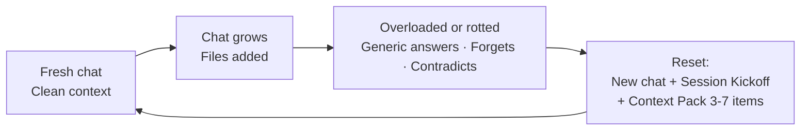

## What this is

The AI can only “see” so much of your chat and files at once. When too much is in there, it gets confused or forgets things. This page tells you how to spot that, how to fix it (the reset recipe), and how to bring only the important stuff into a new chat (carryover summary and repo map).



---

## Signs the context window is overloaded

The AI has too much in its “memory” and starts acting weird.

**Examples:**

* It gives **generic** answers that don’t match your project (e.g. suggests a file or pattern you don’t use).
* It **asks for something you already said** (e.g. “What’s the platform type?” after you put it in the Context Pack).
* Responses get **slow** or the AI seems to “think” for a long time.
* It **stops following your rules** (e.g. asks five questions at once instead of one).
* You pasted a **huge thread** or many files and the AI starts ignoring parts of it.

When you see these, it’s time to reset (see below).

---

## Signs of context rot

The conversation has been going on so long that the AI’s picture of the project is wrong or fuzzy.

**Examples:**

* It **forgets earlier decisions** (e.g. you agreed on “internal only” but it suggests a public API).
* It **contradicts itself** (says X in one message and the opposite later).
* It **repeats the same idea** over and over instead of moving on.
* It **invents file names or structure** that don’t exist in your repo.
* It **mixes up two tasks** (e.g. talks about the login screen when you’re on the settings page).

When you see these, start a new chat and use the reset recipe.

---

## The reset recipe

Do this when the context is overloaded or rotten.

**Do this:**

1. **Start a new chat.** Don’t keep going in the same one.
2. **Paste Session Kickoff** (so the AI knows the kit’s rules again).
3. **Paste a fresh Context Pack** with:
   * Platform type, exposure level, data sensitivity.
   * Only **3–7 relevant files or bullets** for what you’re doing next. Do not paste the whole old thread or 20 files.
4. **Paste the Router** if you need it to choose SPEC vs IMPLEMENT.

That’s it. The new chat has a clean “memory” and only the stuff that matters for the next step.

---

## Carryover summary (max 8 bullets)

When you reset, you don’t need to retype everything. Write a short **carryover summary** (max 8 bullets) and paste it into the new chat after Session Kickoff and Context Pack. It tells the AI what was decided and what happens next.

**Template (paste and fill only what applies):**

* What we decided or already did
* What we’re doing next (and what we’re not doing)
* Open questions or blockers
* Key files or artifacts
* Next recommended step
* (Optional) Assumptions or constraints
* (Optional) Security / exposure / data-sensitivity notes
* (Optional) Where to look for more detail

Keep each bullet one line. No code. Then paste your Context Pack (3–7 items) and continue.

---

## Repo Map prompt (paste this)

When the AI keeps inventing paths or you’re not sure where things live, start a **new chat**, paste Session Kickoff and Context Pack, then paste this:

```text
Create a short repo map (max 15 bullets) and best insertion points for the kind of work we do. Include: main app entry, routing, state/data, key screens or modules, config, and where to add new features or tests. Use only paths and names that exist in this repo. If something is unclear, ask exactly one question and stop.
```

The AI will give you a short map you can keep in `docs/ai/current-state.md` or paste into future Context Packs so it stops guessing.

---

## Common mistakes

* Pasting the **entire old thread** into a new chat. That overloads the context again. Use the carryover summary (max 8 bullets) instead.
* Putting **20 files** in the Context Pack after a reset. Stick to 3–7 so the AI stays focused.
* Not starting a **new chat** when the AI is clearly confused or contradicting itself. One more message in the same chat usually doesn’t fix it.

---

See also: [Context references (@Codebase, @file, docs/ai/)](context-references).
