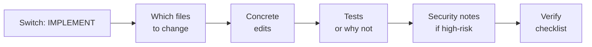

# What this is

  

IMPLEMENT mode is for writing and changing code. The AI suggests files to change, edits, and tests.

## Advisories block

At the top of replies you may see an **Advisories** block. It tells you how the AI is working and when you should change something.

* **Route** — Is the AI in plan mode (SPEC) or code mode (IMPLEMENT) for this reply?
* **Model class** — Fast (quick), Reasoning (hard stuff), or Best-coding (many files). The AI suggests which fits.
* **Context risk** — Low, Medium, or High. How likely the AI is to get mixed up with the files and chat you have open.
* **HIGHLY RECOMMENDED** — The AI is saying: you should do something (switch mode, use a stronger model, or start a new chat). Do what it says in the reply.

### When the AI says HIGHLY RECOMMENDED (security)

The AI will say HIGHLY RECOMMENDED when the work touches things that need extra care, for example:

* Login, auth, or sessions
* Permissions or who can do what
* Exports, downloads, bulk actions, or reporting
* Restricted or confidential data
* External or public exposure
* Integrations or webhooks
* File uploads
* Secrets, tokens, or credentials

When you see that, follow the suggestion in the response (e.g. security notes and security acceptance criteria).

## When to use it

Use IMPLEMENT when you want:

* A plan for a pull request (PR).
* Code edits and file changes.
* Tests or a reason why not.
* Bug fixes.

## Steps

**Do this:**

1. Say **Switch: IMPLEMENT** or ask directly: “Implement this change.”
2. The AI gives you an “Implementation Package” with:
   * Which files to change
   * A short plan
   * Concrete edits
   * A checklist to verify
   * Tests (or why not)
   * Security notes if you are touching login, permissions, secrets, uploads, etc.
3. The AI should make small, safe changes. It should not invent file paths or APIs. If it is stuck, it asks exactly one question.

## Common mistakes

* Asking for code when you have no spec. For bigger changes, do SPEC first, then **Switch: IMPLEMENT**.
* Letting it make up file names or APIs. Say: “Do not invent. Ask for the exact file you need.” Add more info to `docs/ai/current-state.md` so the AI knows the real structure.
* Ignoring security notes. If you touch login, permissions, or sensitive data, read the security part of the response.

## API usage

If your API usage is high, stay on Auto/Fast unless the AI says HIGHLY RECOMMENDED.
