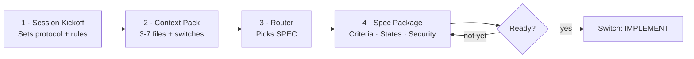

# What this is

SPEC mode is the default. It helps you think and plan before writing code.

You get a clear description of the problem, what “done” looks like, and what could go wrong.

## Advisories block

At the top of replies you may see an **Advisories** block. It tells you how the AI is working and when you should change something.

* **Route** — Is the AI in plan mode (SPEC) or code mode (IMPLEMENT) for this reply?
* **Model class** — Fast (quick), Reasoning (hard stuff), or Best-coding (many files). The AI suggests which fits.
* **Context risk** — Low, Medium, or High. How likely the AI is to get mixed up with the files and chat you have open.
* **HIGHLY RECOMMENDED** — The AI is saying: you should do something (switch mode, use a stronger model, or start a new chat). Do what it says in the reply.

### When the AI says HIGHLY RECOMMENDED (security)

The AI will say HIGHLY RECOMMENDED when the work touches things that need extra care, for example:

* Login, auth, or sessions
* Permissions or who can do what
* Exports, downloads, bulk actions, or reporting
* Restricted or confidential data
* External or public exposure
* Integrations or webhooks
* File uploads
* Secrets, tokens, or credentials

When you see that, follow the suggestion in the response (e.g. get a threat-model-lite in SPEC or security notes in IMPLEMENT).

## When to use it

Use SPEC when:

* You are not sure yet what the best solution is.
* You need a list of what must be true when you are done (acceptance criteria).
* You need to think about loading, empty, error, and success screens.
* You want to check the problem before building.
* You want to think about security risks.

## Steps

**Do this:**

1. Paste the Session Kickoff.
2. Paste a filled Context Pack (platform type, exposure, data sensitivity).
3. Paste the Router prompt.
4. The AI gives you a “Spec Package” with:
   * What problem we are solving
   * What “done” looks like (acceptance criteria)
   * What we are not doing (non-goals)
   * Loading / empty / error / success states
   * Accessibility and risks
5. If the AI asks a question, it must ask only ONE. Answer it, then it continues.
6. When you want code, say **Switch: IMPLEMENT**.

## Common mistakes

* Skipping the Context Pack. The AI needs platform type and exposure to give a good spec.
* Letting it ask five questions. Reply: “Ask exactly one question and stop.”
* Going straight to code without a spec. You can, but for anything non-trivial, do SPEC first so the AI does not invent the wrong thing.

## API usage

If your API usage is high, stay on Auto/Fast unless the AI says HIGHLY RECOMMENDED.
