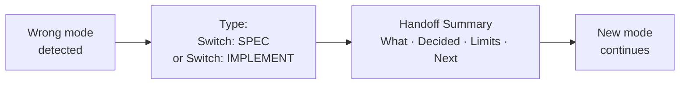

# What this is

Sometimes the AI starts doing the wrong thing (e.g. writing code when you wanted a plan, or writing a long spec when you wanted code). Switching changes the mode so you and the AI are aligned.

## Advisories block

At the top of replies you may see an **Advisories** block. It tells you how the AI is working and when you should change something.

* **Route** — Is the AI in plan mode (SPEC) or code mode (IMPLEMENT) for this reply?
* **Model class** — Fast (quick), Reasoning (hard stuff), or Best-coding (many files). The AI suggests which fits.
* **Context risk** — Low, Medium, or High. How likely the AI is to get mixed up with the files and chat you have open.
* **HIGHLY RECOMMENDED** — The AI is saying: you should do something (switch mode, use a stronger model, or start a new chat). Do what it says in the reply.

The AI may say HIGHLY RECOMMENDED when the work touches login, permissions, exports, restricted data, external exposure, integrations, uploads, or secrets. When you see that, follow the suggestion in the response.

## When to use it

Use it when the AI is in the wrong “mode”:

* It is writing code but you wanted a plan first → **Switch: SPEC**
* It is writing a long spec but you want code now → **Switch: IMPLEMENT**

## Steps

**Do this:**

1. Type exactly one of these:
   * **Switch: SPEC**
   * **Switch: IMPLEMENT**
2. The AI must then write a short “Handoff Summary”:
   * What we are trying to do right now
   * What we already decided
   * Important limits or rules
   * What we still don’t know
   * What happens next
3. After that, it continues in the new mode.

## Common mistakes

* Typing a long message instead of just “Switch: SPEC” or “Switch: IMPLEMENT.” Keep the switch command clear.
* Expecting it to redo everything. The handoff summary keeps context so you don’t lose work and the AI does not mix spec text with code.

## API usage

If your API usage is high, stay on Auto/Fast unless the AI says HIGHLY RECOMMENDED.
