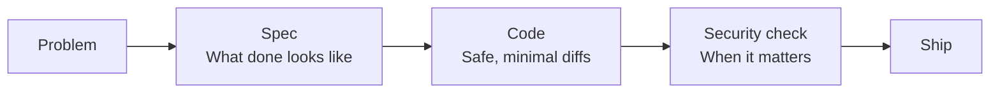

# What this is

This is a kit that helps you use AI (like Cursor) in a clear, safe way.

* It helps you figure out the right problem before you build.
* It helps you write down what you want (a spec).
* It helps you write code without making up stuff.
* It reminds you to think about security.

It works with Cursor and with GitHub Copilot.

## When to use it

Use it when you want AI to help you plan or code without getting confused or inventing things.

## Steps

1. **Get the kit:** For a **new project**, use the starter zip (see [Downloads](downloads))—unzip it and open that folder as your project root. For an **existing project**, use the kit-only zip or copy the kit into your repo root (see [Install by copying](install-by-copying)). The kit files (`.cursor/`, `docs/`, etc.) must be at the **project root**, not inside a subfolder.
2. Fill in a few placeholders (design system, project info). See [What to fill in](what-to-fill-in).
3. When you start work, paste the Session Kickoff and Context Pack.
4. If the AI does the wrong thing, type: **Switch: SPEC** or **Switch: IMPLEMENT**.

## Common mistakes

* Skipping the Context Pack. The AI needs it to stay focused.
* Letting the AI ask many questions at once. It should ask only ONE question, then you answer, then it continues.
* Forgetting to switch. If it is writing specs and you want code, type **Switch: IMPLEMENT**. If it is writing code and you want a plan first, type **Switch: SPEC**.
