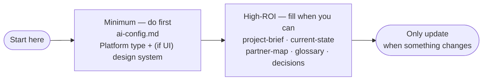

These are the only parts of the kit that need your input. Keep them small. Only update them when something changes.

The only **required** setup is your project root and (for UI work) a design system. Back-end-only or CLI projects can leave the design system as TODO.

---

## The minimum (you should do this)

**File:** `docs/ai/ai-config.md`

1. **Platform type** — Slug and description of what you're building (e.g. `consumer-app`, `data-platform`, `developer-platform`). The AI uses this for architecture and security decisions.
2. **Design system (if you have UI)** — Name, docs URL, and import pattern. **Skip or leave TODO** if this project has no UI (e.g. API, CLI, data pipeline). If you have a UI and skip these, the kit still works but the AI may invent UI patterns.

See the full template: [AI Config (reference)](../reference/ai-config).

---

## High‑ROI files (fill when you can)

These files give the AI clear truth so it doesn’t guess or hallucinate. Fill them a bit at a time.

| File | What it does | Reference |
|------|----------------|-----------|
| `docs/ai/project-brief.md` | One sentence about the product, who uses it, what “done” looks like, and what you’re *not* doing. | [Project Brief](../reference/project-brief) |
| `docs/ai/current-state.md` | How your repo works: routing, data, state, forms, styling, testing, telemetry. “What we do / where it lives / what to avoid” so the AI doesn’t invent paths. | [Current State](../reference/current-state) |
| `docs/ai/partner-map.md` | Who owns what, when to involve them, and who to ask when stuck. | [Partner Map](../reference/partner-map) |
| `docs/ai/glossary.md` | A short list of terms you want everyone (and the AI) to use the same way. Cap at ~10–20 terms. | [Glossary](../reference/glossary) |
| `docs/ai/decisions.md` | A log of big decisions: what you decided, why, and what you gave up. Append new ones at the top. | [Decisions](../reference/decisions) |
| `docs/ai/checklists/*` | Spec DoD, Impl DoD, Security DoD, and Threat Model Lite. Use them so “done” means the same thing every time. | [Spec DoD](../reference/spec-dod), [Impl DoD](../reference/impl-dod), [Security DoD](../reference/security-dod), [Threat Model Lite](../reference/threat-model-lite) |

---

## Simple rule

**Only update these when something changes. Keep them small.**

You don’t have to fill everything on day one. Start with the minimum (platform type and, if you have UI, design system in `ai-config.md`), then add a few bullets to project-brief and current-state when you have time. The more you fill, the less the AI will guess—and the fewer mistakes you’ll get.
