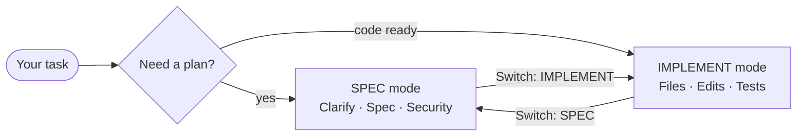

# AI Productivity Kit

A small **AI Kit** for working faster and more safely with Cursor (and optionally GitHub Copilot).

:::tip Quick start (5 minutes)
**Step 1 — Get the files**  
Download `ai-kit-only.zip` from [Releases](https://github.com/rwyatt2/AI-Productivity/releases) and unzip into your project root. Or copy everything from `kit/` into your project root.

**Step 2 — Fill in your config**  
Open `docs/ai/ai-config.md` and fill in:
- Your design system name and docs URL
- Your component import pattern (e.g. `import { Button } from '@/components/ui'`)

**Step 3 — Open Cursor and paste the Session Kickoff**  
Start a new Composer session and paste the Session Kickoff prompt.  
Full text: [Session Kickoff reference](reference/session-kickoff).

**Step 4 — Type your first task**  
The AI will clarify one thing if it needs to, then plan before coding.
:::

## What it does

- **Spec-first** — Clarify the problem and acceptance criteria before code.
- **Two modes** — **SPEC** (planning, PM, design, security) and **IMPLEMENT** (code, tests, safe diffs).
- **One question at a time** — The AI asks exactly one question when it needs input, then continues.
- **Switches** — Say `Switch: SPEC` or `Switch: IMPLEMENT` when the conversation goes the wrong way.

## How SPEC and IMPLEMENT work together

## Get started

1. **[What is this?](getting-started/what-is-this)** — Overview and big idea.
2. **[Install (by copying the kit)](getting-started/install-by-copying)** — Copy the `kit/` into your repo and fill placeholders.
3. **[Daily workflow (SPEC-first)](daily-workflow/spec-first)** — Session Kickoff, Context Pack, Router.
4. **[Cursor modes](daily-workflow/cursor-modes)** — Chat vs multi-file vs small edits.
5. **[Context windows](daily-workflow/context-windows)** — Overload, rot, and reset.
6. **[Model switching](daily-workflow/model-switching)** — When to use fast vs reasoning vs best-coding.

**Preview the kit files:** See the folder structure and exact text of each file in [Reference → Kit file preview](reference/kit-preview). To understand when and how to use **agents** (e.g. @Security, @PM), see [Context pack → Agents](context-pack/agents).

Use the **Docs** menu on the left to browse the full guide.
