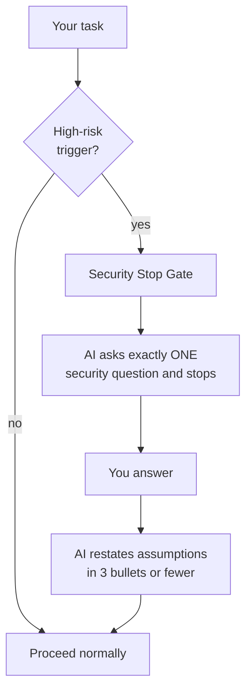

# What this is

Security triggers are situations where you must be extra careful. When you touch login, permissions, exports, secrets, uploads, or sensitive data, the kit expects you to do a short threat model and write security acceptance criteria (things you can check before you ship).

## When to use it

Use it when your task touches any of these:

* Login, permissions, or roles
* Admin features
* Data export or download
* Secrets, tokens, or credentials
* File uploads
* URLs or rich text (e.g. user content)
* Integrations, webhooks, or calls to other systems
* Anything that uses confidential or restricted data

## Steps

**Do this:**

1. When you see security notes in the AI’s response, don’t skip them. Read the threats and mitigations.
2. Fill a short threat model (see Threat model (lite)): exposure, data sensitivity, what to protect, main threats, mitigations, and security acceptance criteria.
3. Add security acceptance criteria to your “definition of done” so you can test them (e.g. “User A cannot see User B’s data”).

## Security stop gate (why the AI may stop)

When a task is high-risk (auth, permissions, exports, uploads, integrations, external exposure, or confidential/restricted data), the AI will not guess. It will ask **exactly one** security question and stop. This is on purpose.

What you do: answer that one question. Then the AI continues and restates what it now assumes in a few bullets.

Example question: *"What is the exposure level: internal, external-authenticated, or public?"*

## Common mistakes

* Assuming “it’s only internal” so security doesn’t matter. Internal tools can still leak data or be misused.
* Skipping the threat model when you add login or permissions. That’s when you need it most.
* Writing vague criteria like "secure." Write testable checks (e.g. "API returns 403 when the user doesn't have permission").

## Reference

* [Cursor Rules – Security (Reference)](../reference/cursor-rules-security)
