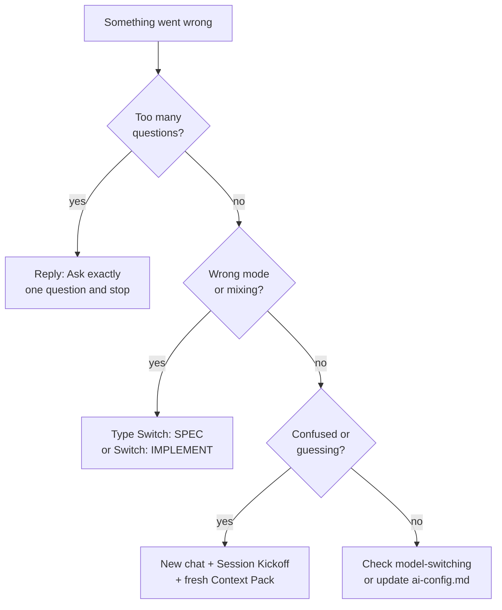

# What this is

This page lists problems people often hit and the simplest way to fix them. Each fix is short: one reply or one command.

## When to use it

Use it when the AI is asking too many questions, making things up, getting confused, or doing the wrong kind of work (spec vs code).

## Advisories block

At the top of replies you may see an **Advisories** block. It tells you how the AI is working and when you should change something.

* **Route** — Is the AI in plan mode (SPEC) or code mode (IMPLEMENT) for this reply?
* **Model class** — Fast (quick), Reasoning (hard stuff), or Best-coding (many files). The AI suggests which fits.
* **Context risk** — Low, Medium, or High. How likely the AI is to get mixed up with the files and chat you have open.
* **HIGHLY RECOMMENDED** — The AI is saying: you should do something (switch mode, use a stronger model, or start a new chat). Do what it says in the reply.

The AI says HIGHLY RECOMMENDED when the work touches things that need extra care: login/auth, permissions, exports or bulk/reporting, restricted or confidential data, external or public exposure, integrations or webhooks, file uploads, or secrets/tokens. Follow the suggestion in the response.

## Steps (fixes)

**Do this:**

* **“It asked me 5 questions at once.”**  
  Reply: “Ask exactly one question and stop.”

* **“It is making up file paths or APIs.”**  
  Reply: “Do not invent. Ask for the exact file you need.”  
  Also add more real info to `docs/ai/ai-config.md` (e.g. the **Project** / current-state section: routing, state, data, file layout) so the AI has truth to use.

* **“The conversation got confused.”**  
  Start a new chat. Paste Session Kickoff and a fresh Context Pack. Then paste the Router. Don’t paste a huge old thread. See [Context windows](../daily-workflow/context-windows).

* **“I keep getting plausible-but-wrong answers.”**  
  See [Model switching](../daily-workflow/model-switching) (switch up to a stronger or best-coding model).

* **“I’m not sure which Cursor mode to use (Chat vs multi-file vs small edit).”**  
  See [Cursor modes](../daily-workflow/cursor-modes).

* **“I need code but it is writing specs.”**  
  Type: **Switch: IMPLEMENT**

* **“It is writing code but I need the spec first.”**  
  Type: **Switch: SPEC**

* **"My API usage is high."**  
  Stay on Auto/Fast unless the AI says HIGHLY RECOMMENDED.

* **"It stopped and asked one security question."**  
  Answer it. That is the security stop gate. See [Security triggers](../security/triggers) for context.

## Common mistakes

* Replying with a long message instead of the exact phrase. “Ask exactly one question and stop” and “Switch: IMPLEMENT” work because they are clear and short.
* Not updating `docs/ai/ai-config.md` (Project / current-state) when the AI invents structure. The more real context you give, the less it will invent.
